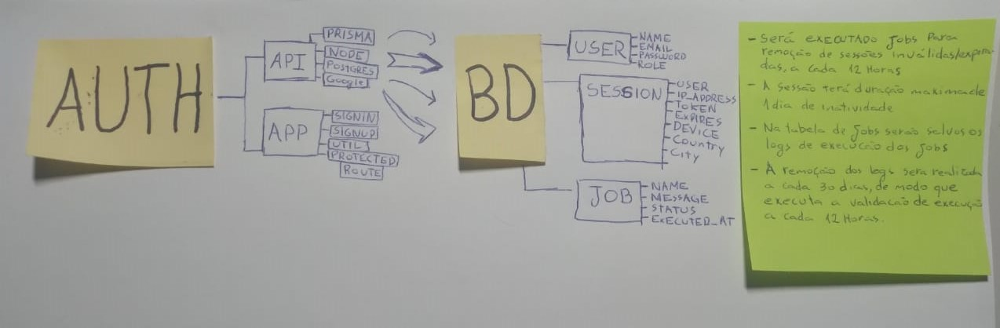

# Descrição

api em node para realizar a autenticação
microfront-ends usando single-spa e react js

# Configuração do projeto

docker compose -f docker-compose.yml up -d
npx prisma migrate deploy

# push docker hub

docker build -t pablocogo/login .
docker push pablocogo/login

# Fluxograma

